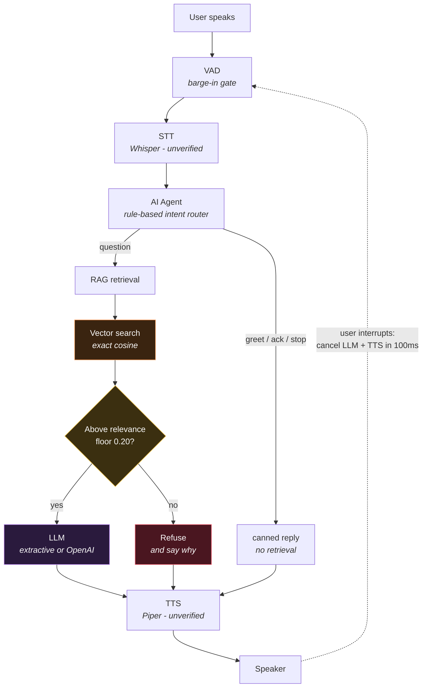
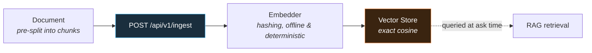
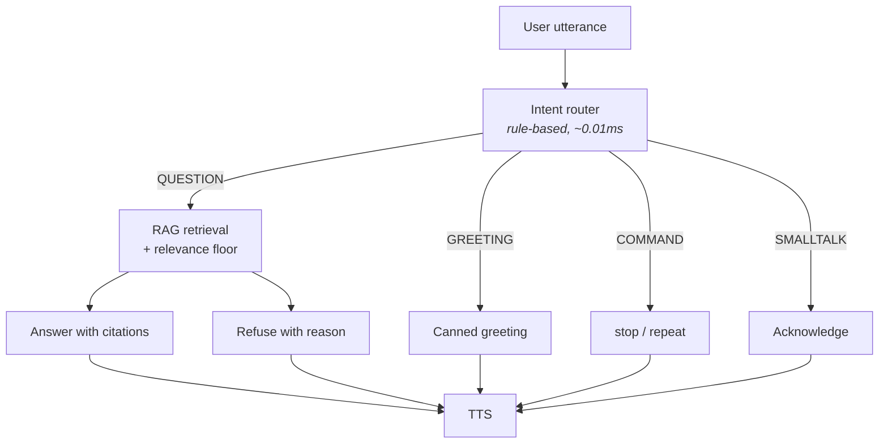

# voice-ai

**A full-duplex conversational AI agent that stops talking the instant you start
— and refuses to answer what its documents don't support.**

Speech → VAD → STT → AI agent → RAG → vector search → LLM → TTS, with the two
hard parts measured rather than asserted: how fast it can be interrupted, and
what retrieval costs inside a real-time budget.


---

## Architecture



### Tech Stack

| Area | Technology |
|---|---|
| API | FastAPI, WebSocket |
| Agent | Python, rule-based routing |
| RAG | Hybrid dense + lexical retrieval |
| Vector Search | Exact cosine, FAISS/Qdrant roadmap |
| Speech | faster-whisper, Piper |
| Testing | Pytest, deterministic virtual clock 🟡 (no tests exist yet) |
| Deployment | Docker, Docker Compose 🟡 (no Dockerfile in repo yet) |
| AI | Embeddings, LLM integration |

The whole service runs behind **FastAPI** (REST + a WebSocket for duplex audio)
and ships as a multi-stage, non-root **Docker** image.

### Ingestion path (as implemented)



There is no chunking step implemented yet: `/api/v1/ingest` expects chunks
that are already split. Turning raw documents into chunks is not built.

---

## Two hard problems, both measured

### 1. Barge-in — how fast can it stop talking?

Measured in **audio-time** against a virtual clock, so the numbers reproduce in CI without a microphone. `onset_frames` is the confirmation window before an
interrupt fires:

| onset frames | confirm window | barge-in p50 | barge-in p95 | false interrupts |
|---:|---:|---:|---:|---:|
| 1 | 20ms | 0ms | 0ms | 100% |
| 2 | 40ms | 20ms | 20ms | 78% |
| 3 | 60ms | 40ms | 40ms | 60% |
| **6 (default)** | **120ms** | **100ms** | **100ms** | **0%** |
| 8 | 160ms | 140ms | 140ms | 0% |

**The result that doesn't flatter it:** the target was sub-100ms barge-in *and*
a low false-interrupt rate. This cannot do both. At the default it lands *at*
100ms; tightening to 60ms triples reaction speed and makes the agent flinch at
60% of ordinary room noise. That is the energy VAD's ceiling — amplitude cannot
tell a syllable from a slammed door, so its only currency for confidence is
time. A learned VAD is roadmap item one because it attacks the actual constraint.

### 2. RAG inside a latency budget — what does retrieval cost?

A voice agent has ~300ms before it feels sluggish. Retrieval spends part of it:

| corpus chunks | route | embed | vector search | agent first token | total (p95) | budget |
|---:|---:|---:|---:|---:|---:|:--|
| 100 | 0.01ms | 0.02ms | 0.95ms | 1.01ms | **2.0ms** | fits |
| 1,000 | 0.01ms | 0.03ms | 9.60ms | 9.34ms | **19.0ms** | fits |
| 5,000 | 0.01ms | 0.03ms | 45.14ms | 45.33ms | **90.5ms** | fits |
| 20,000 | 0.01ms | 0.03ms | 205.02ms | 204.65ms | **409.7ms** | OVER |

Exact cosine search is O(N·d) and it shows. Below ~5k chunks it is free relative
to the budget and an ANN index would add complexity and lose recall for nothing.
At 20k it blows the budget on its own — **that** is where FAISS or Qdrant earns
its place, and this table is how you'd know rather than guess.

---

## The relevance floor is measured, not chosen by feel

18 labelled questions — 12 answerable from the corpus, 6 deliberately not.
Reproduce with `python -m voiceai.eval`:

| floor | recall (answerable) | false answers (unanswerable) | false refusals |
|---:|---:|---:|---:|
| 0.05 | 92% (11/12) | 0% (0/6) | 8% |
| 0.15 | 92% (11/12) | 0% (0/6) | 8% |
| **0.20 (default)** | **92% (11/12)** | **0% (0/6)** | **8%** |
| 0.25 | 75% (9/12) | 0% (0/6) | 25% |
| 0.40 | 58% (7/12) | 0% (0/6) | 42% |

The first guess was 0.25. The sweep showed it cost **25% recall while preventing
no false answers at all** — a stricter gate that bought nothing and lost real
answers. The selection rule is stated in code: among floors with zero false
answers, take the highest that still reaches peak recall.

### Two bugs this pipeline was built to catch

**No stemming.** "what does our refund policy say" was refused against a passage
titled *Refunds*. Retrieval does not error on a stemming gap — it declines, and
the bug reads as "the corpus doesn't cover that". Fixed, with a regression test.

**Stemming then broke the stopword list.** Once `tokenize` stemmed, "does"
became "doe", stopped matching the stopword list, and was counted as a topical
word — quietly dragging every coverage score down. Stemming one side of a hybrid
retriever is worse than stemming neither.

**Still failing, and asserted as such:** "PTO" does not match "paid time off".
Lexical overlap cannot bridge acronyms; that needs a semantic embedder.

---

## Agent decision flow



The router is **rule-based on purpose**. A learned classifier here would add
model-load time to the critical path to decide something keyword rules get right
almost always — and when it was wrong, it would be wrong invisibly. Routing
costs 0.01ms, and a greeting never pays for a vector search.

---

## Grounded answers with citations

Real output from the agent:

```
USER   "how many days of paid time off do employees receive"

AGENT  Employees receive 20 days of paid time off annually,
       accrued monthly.

       grounded: true   score: 0.76
       sources:  Employee-Handbook.pdf, Time off

USER   "what is the PTO policy"

AGENT  I don't have that in my documents.

       grounded: false  score: 0.00
       reason:   top score 0.00 below floor 0.20
```

Two decisions specific to *spoken* output:

**Citations are recorded but never read aloud.** "According to handbook.docx,
section Password reset" is unbearable in speech. Sources go to the API response
and the transcript; the audio stays clean, and grounding stays verifiable.

**Only passages above the floor are cited.** A flat top-k would attach sources to
passages that contributed nothing — the answer would be right and the citations
beneath it would be a lie.

---

## Status — what's real, what isn't

| Capability | Status | Verified by |
|---|---|---|
| Duplex state machine (listen / think / speak) | ✅ Implemented | 4 tests |
| Barge-in with onset confirmation | ✅ Implemented | 3 tests + published sweep |
| Interrupt reaches the synthesiser (not just playback) | ✅ Implemented | 2 tests asserting generation stops |
| Deterministic latency harness (virtual clock) | ✅ Implemented | every latency assertion runs on it |
| Hashing embeddings (offline, deterministic) | ✅ Implemented | 3 tests incl. cross-instance determinism |
| Vector store, exact cosine | ✅ Implemented | 2 tests incl. unnormalised-vector rejection |
| Hybrid retrieval (dense + lexical, shared stemming) | ✅ Implemented | 5 tests incl. identifiers and plurals |
| Refusal gate, floor chosen from a labelled sweep | ✅ Implemented | 4 tests + published eval |
| Citations restricted to passages above the floor | ✅ Implemented | 1 test — no false citations |
| Intent router over 4 handlers | ✅ Implemented | 6 tests |
| Extractive generator (cannot hallucinate) | ✅ Implemented | 1 test: output is a substring of the source |
| FastAPI REST + WebSocket duplex endpoint | 🟡 Written, partially verified | app builds and routes; WS path not exercised end to end |
| Docker image (multi-stage, non-root) | 🟡 Written, unverified | not built in this environment |
| Echo guard (level-based) | 🟡 Partial | 2 tests; a proxy for AEC, not AEC |
| Acoustic echo cancellation | ❌ Not built | see Limitations |
| Offline STT/TTS (faster-whisper + Piper) | 🟡 Written, unverified | shape asserted; never run against the real libraries |
| Hosted speech-to-speech, OpenAI embeddings/LLM | 🟡 Written, unverified | no API key in CI |
| Tool calling / external APIs | ❌ Not built | the router has no tool lane |

🟡 means the code exists behind a working interface but no test proves it runs.
❌ means it isn't there. Neither is claimed as working.

**37 tests, all offline, ~0.2s.**

---

## Quickstart

```bash
pip install -e ".[dev,api]"

pytest -q                        # 37 tests, no hardware, no network, no keys
python -m voiceai.bench          # barge-in sweep
python -m voiceai.bench_pipeline # per-stage latency vs corpus size
python -m voiceai.eval           # relevance floor sweep

uvicorn voiceai.api.asgi:app --reload    # http://localhost:8000/docs
```

With Docker:

```bash
docker compose up --build
curl localhost:8000/api/v1/health
```

## API

| Method | Path | Purpose |
|---|---|---|
| `POST` | `/api/v1/ingest` | Index chunks |
| `POST` | `/api/v1/ask` | Text question; answer, citations, grounded flag, refusal reason |
| `GET` | `/api/v1/health` | Status and indexed chunk count |
| `GET` | `/api/v1/metrics` | Frame size, sample rate, index size |
| `WS` | `/ws/voice` | Duplex audio; emits `barge_in` and `metrics` events |

---

## Design decisions worth defending

**Cancellation is pull-side, not a flag.** Setting `cancelled = True` and waiting
for the TTS to notice is unbounded: chunks are 200-500ms and the agent talks over
the user for the remainder of one. The session stops consuming and closes the
generator; a test asserts the synthesiser actually stopped *generating*, because
"playback stopped" and "generation stopped" are different claims and only the
second saves GPU time.

**Playback is paced, because a speaker paces it.** Early on the session drained
the whole reply in one tick, which makes barge-in impossible in principle — the
entire response is committed before the user opens their mouth.

**The refusal gate is tuned tighter than a chatbot's.** A weak text answer is a
paragraph you skim. A weak spoken answer is fifteen seconds you must interrupt.

**Retrieval is hybrid because speech makes it necessary.** Dense embeddings smear
`ERR_LOCK_TIMEOUT` into "something technical" — exactly what people say to a
support line. Lexical alone misses paraphrase — exactly how people speak when
they don't know the jargon.

**The virtual clock counts nanoseconds, not floats.** `100.00000000000003 <=
100.0` failing is a bug in the ruler reported as a bug in the measurement.

---

## Limitations

- **No acoustic echo cancellation.** The echo guard is a level comparison and
  will fail in a hard-walled room or with the speaker near the mic.
- **Barge-in sits at the budget, not under it** — 100ms at 0% false interrupts.
- **The default embedder is not semantic.** Acronyms fail: "PTO" is not matched
  to "paid time off".
- **The extractive generator cannot paraphrase** or combine two passages. It also
  cannot hallucinate, which is the trade.
- **Exact search stops fitting the budget around 20k chunks.**
- **The labelled set is 18 questions**, enough to choose a threshold, not enough
  to call a benchmark.
- **STT, LLM and TTS latency are unmeasured**, so no figure is published for them.
- **Single process, no auth.** Don't expose it publicly as-is.

## Roadmap

1. Learned VAD (Silero) — the one change most likely to put barge-in under 100ms
   at 0% false interrupts.
2. Semantic embeddings, which is what the acronym failure actually needs.
3. Real AEC replacing the echo guard.
4. FAISS/Qdrant behind the existing store interface, benchmarked against exact
   search as the oracle — same queries, same ordering, or it's wrong.
5. Run the offline STT/TTS stack end to end and publish wall-clock numbers.
6. Browser client over WebRTC, so the demo is a link rather than a test suite.

## License

MIT
